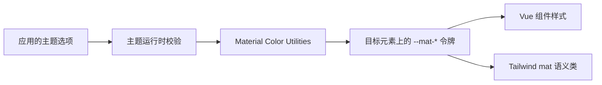
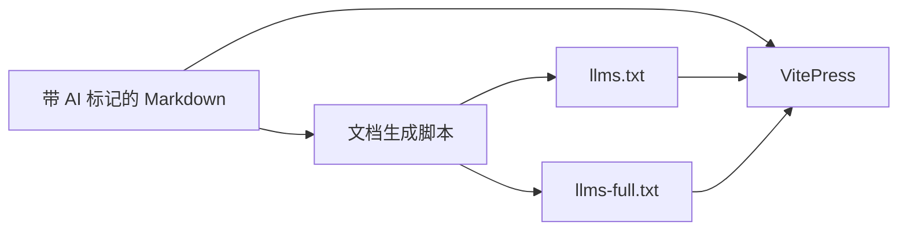

# 架构说明

## 当前状态

`mdu-ui` 是一个私有的 Vue 3 单包组件库。源码由包 `exports` 直接暴露给使用方的 Vue/Vite 构建过程；仓库同时包含本地 demo、VitePress 中文文档、测试和由 Markdown 生成的 AI 文档。

长期技术选择及原因记录在 [ADR 索引](adr/README.md)；公共概念和不变量见 [核心抽象](ABSTRACTIONS.md)。

## 架构原则

- 运行时只面向 Vue 3 客户端应用和最新浏览器。
- 组件渲染、主题计算、CSS 令牌和文档生成保持边界清晰。
- 组件只读取语义令牌，不自行计算 Material 配色。
- 原生 CSS 令牌是运行时权威值；Tailwind 适配层只提供静态名称映射。
- Markdown 是人工维护的使用文档权威来源，AI 文本是生成产物。
- 包不生成或提交用于分发的 `dist/`。

## 技术栈

| 技术 | 职责 |
| --- | --- |
| Vue 3 | 组件、插件和组合式主题 API |
| JavaScript 与 JSDoc | 运行时实现和公共接口说明 |
| 原生 CSS | 设计令牌、组件样式和状态层 |
| Material Color Utilities | 从种子色生成 Material 3 动态配色 |
| Tailwind CSS v4 | 可选的语义工具类适配 |
| Vite | demo 与公开入口构建检查 |
| VitePress | 中文文档和交互示例 |
| Vitest 与 Vue Test Utils | 组件和主题行为测试 |

## 模块边界

### 公共入口

`src/index.js` 是完整包入口，导出 `MatBtn`、`createMatUi()` 和 `useMatTheme()`。单组件入口允许只导入 `mdu-ui/components/mat-btn`。`mdu-ui/styles.css` 和 `mdu-ui/tailwind.css` 分别暴露基础令牌与可选 Tailwind 映射。

公共入口不得依赖 demo、VitePress 或测试代码，也不得要求安装 IDE 专用工具。

### 主题运行时

主题模块负责校验主题选项、调用 Material Color Utilities、将结果写入目标元素的 `--mat-*` CSS 自定义属性，并在 `system` 模式下监听系统亮暗偏好。它向 Vue 应用提供可响应的当前配置、解析后的实际模式、运行时修改方法和清理方法。

主题模块不读取或写入 `localStorage`，也不决定应用应何时保存用户选择。

### 组件

每个组件拥有自己的 Vue SFC、公开入口、样式与测试。组件接收 Vue props 和原生属性，使用全局语义令牌表达颜色、形状、排版、阴影、动效和状态。首个组件 `<mat-btn>` 以原生 `<button>` 为语义基础。

### 样式层

基础样式声明 `--mat-color-*`、`--mat-shape-*`、`--mat-type-*`、`--mat-shadow-*`、`--mat-motion-*` 和 `--mat-state-*`。组件可提供窄范围的 `--mat-<component>-*` 覆盖入口。

Tailwind 适配文件通过 `@theme inline` 将上述值映射到带 `mat` 前缀的 Tailwind 主题变量，不重新定义主题来源。

### demo、文档与 AI 文档

demo 从包的公开出口加载组件和样式，用于人工查看主题与组件状态。VitePress 页面是中文使用文档及交互示例。带 frontmatter 标记的 Markdown 页面按顺序生成根目录 `llms.txt` 和 `llms-full.txt`；内部架构文档和纯交互页面不进入 AI 使用文档。

## 关键数据流

## 外部依赖与运行边界

- Vue 是 peer dependency，由使用方应用提供。
- Material Color Utilities 是主题运行时依赖。
- Tailwind CSS v4 是可选 peer dependency；不使用 Tailwind 的项目只导入基础样式。
- 项目无服务端、数据库、缓存、遥测或远程运行时服务。
- 私有 GitHub 仓库是源码分发边界，使用方应锁定具体提交。

## 构建与验证

Vite 构建检查从公开 `exports` 导入 `.vue` 和 CSS，验证普通 Vue/Vite 使用方能直接编译源码。文档、测试和静态检查在 Node.js 24 环境中运行；构建产物仅用于验证并保持忽略。

## 安全与可靠性边界

- 主题输入在写入 CSS 属性前校验，非法种子色、模式、变体和对比度必须明确失败或按公共 API 约定处理。
- `system` 模式创建的媒体查询监听必须可清理，避免应用卸载后继续更新状态。
- 组件不执行网络请求，不持有业务数据，也不承担表单校验或权限控制。

## 相关决策

- [0001 — 通过私有 Git 直接分发源码](adr/0001-distribute-source-from-private-git.md)
- [0002 — 采用运行时令牌与 Tailwind 适配双层主题](adr/0002-runtime-and-tailwind-theme-layers.md)
- [0003 — 从 Markdown 生成 AI 使用文档](adr/0003-generate-ai-docs-from-markdown.md)
