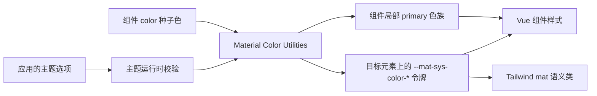
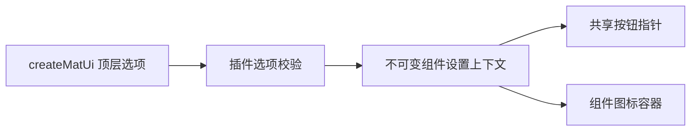
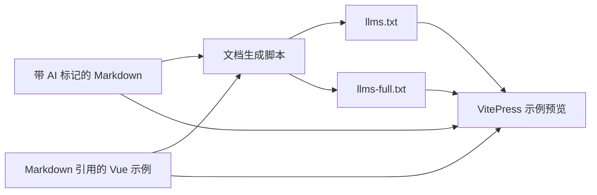

# 架构说明

## 当前状态

`mdu-ui` 是一个私有的 Vue 3 单包组件库。源码由包 `exports` 直接暴露给使用方的 Vue/Vite 构建过程；仓库同时包含带实时预览的 VitePress 中文使用文档、项目维护文档、测试和由 Markdown 生成的 AI 文档。

长期技术选择及原因记录在 [ADR 索引](adr/README.md)；公共概念和不变量见 [核心抽象](ABSTRACTIONS.md)。

## 架构原则

- 运行时只面向 Vue 3 客户端应用和最新浏览器。
- 组件渲染、主题计算、CSS 令牌和文档生成保持边界清晰。
- 组件默认读取语义令牌；显式十六进制 `color` 通过共享配色模块生成局部 Material 配色，不在组件内重复计算规则。
- 原生 CSS 令牌是运行时权威值；Tailwind 适配层只提供静态名称映射。
- Markdown 及其直接引用的 Vue 示例文件是人工维护的使用文档权威来源，AI 文本是生成产物。
- 包不生成或提交用于分发的 `dist/`。

## 共享组件基础层

`MatSurfaceBase` 负责表面组件的动态原生根元素和属性透传；`MatActionBase` 统一处理 button/link 及内部可聚焦宿主的禁用、状态层和键盘指针交互；`MatSelectionControlBase` 统一处理选择控件的原生 input、标签、48px 目标区、40px 状态层、属性路由和插件指针设置。`MatTextInputBase` 统一文本输入的原生属性路由、浮动标签和辅助信息，`MatItemContentBase` 统一 List 与 MenuItem 的无语义内容排列，`useRovingFocus` 只管理 DOM 顺序和 tabindex，不定义组件键盘含义。这些基础层均为内部实现，不作为公共入口导出。

## 技术栈

| 技术 | 职责 |
| --- | --- |
| Vue 3 | 组件、插件和组合式主题 API |
| JavaScript 与 JSDoc | 运行时实现和公共接口说明 |
| 原生 CSS | 设计令牌、组件样式和状态层 |
| Material Color Utilities | 从种子色生成 Material 3 动态配色 |
| Tailwind CSS v4 | 可选的语义工具类适配 |
| Vite | 公开入口构建检查与 VitePress 开发服务 |
| VitePress | 中文文档和交互示例 |
| Vitest 与 Vue Test Utils | 组件和主题行为测试 |

## 模块边界

### 公共入口

`src/index.js` 是完整组件包入口，导出 Icon、Button、Card、List、Divider、Spacer、Loader、Tooltip、Snackbar、选择控件、Text field、Textarea、Menu、Dialog 组件族以及 `createMatUi()` 和 `useMatTheme()`。Dialog 与 Snackbar 命令式函数由独立的 `mdu-ui/functions` 入口导出，不从根入口或对应组件子入口重复导出。每个公共组件分别提供 `mdu-ui/components/<组件目录>` 单组件入口，复合组件的父子入口导出与根入口相同的组件对象。`mdu-ui/styles.css` 和 `mdu-ui/tailwind.css` 分别暴露基础令牌与可选 Tailwind 映射。

公共入口不得依赖文档预览、VitePress 或测试代码，也不得要求安装 IDE 专用工具。

### 主题运行时

主题模块负责校验主题选项、按 Material 2025 phone 规格调用 Material Color Utilities、将 53 个颜色角色写入目标元素的 `--mat-sys-color-*` CSS 自定义属性，并在 `system` 模式下监听系统亮暗偏好。它向 Vue 应用提供可响应的当前配置、解析后的实际模式、运行时修改方法和清理方法。

共享配色模块同时服务全局主题与组件级十六进制种子色。组件局部配色只读取当前方案和对比度，生成亮暗 primary 色族并通过有界缓存复用结果；它不会写入主题目标。

主题模块不读取或写入 `localStorage`，也不决定应用应何时保存用户选择。

### 插件配置

`createMatUi()` 校验顶层插件选项，创建主题控制器，并通过独立的 Vue provide 上下文向组件提供不可变设置。当前组件设置包括是否为可用交互组件显示手指指针，以及组件图标容器使用的全局 `iconClass`。顶层选项不会写入主题控制器；未安装插件的按需组件使用同一组默认设置。

### 组件

每个组件拥有自己的 Vue SFC、公开入口、样式与测试。`MatSpacer` 是不进入无障碍树的空 flex 子元素，只通过增长分配父容器主轴剩余空间。`MatBtn` 以同一个原生 `<button>` 组件提供普通按钮和图标模式：非空 `icon` 切换为图标模式，普通模式可使用 `prefix`、`suffix` 或同名 Slots。按钮组与 split button 使用 Vue provide/inject 协调 `MatBtn` 子按钮，不复制交互协议。split button 只负责两侧按钮、展开状态和 ARIA，不渲染菜单。

Icon 统一字体字形、SVG 资源和默认 Slot 中的 SVG 元素，负责 Material Symbols 经典四轴、尺寸、内容颜色和动态根标签。内容来源优先级固定为 `src`、`icon`、默认 Slot；组件级 `iconClass` 可覆盖或关闭插件全局值。按钮、List、Menu 和文本输入复用同一公共 Icon 实现，但各自负责上下文尺寸、颜色和无障碍语义。

List 通过内部 provide/inject 上下文统一交互模式、受控选择和焦点刷新。普通与操作模式保留 `ul/li`，选择模式使用 `listbox/option`；roving tabindex 注册表按 DOM 顺序协调项目主操作和 multi-action trailing 控件，并在模式切换或卸载时恢复使用方原有的 tabindex。Divider 根据 List 上下文切换合法的根语义，不参与选择与焦点顺序。

Text field 与 Textarea 共享视觉基础层，但分别保留原生 input 与 textarea。Menu 组合 `MatSurfaceBase` 与 Popover，通过受控 `modelValue` 管理显示，支持元素 id 的 CSS anchor 定位和 `[clientX, clientY]` 视口坐标定位，并负责 offset、视口夹紧、多级开关和 menu/menuitem 键盘语义；MenuItem 组合 `MatActionBase`。MatMenuGroup 提供带可选标签的 `role="group"`、独立 level 2 表面和 expressive 间隙分组。Menu 与 List 只共享无语义内容排列和 roving focus 工具，不共享选择模型或根语义。Divider 在 Menu 中切换为 separator。

Dialog 组合 `MatSurfaceBase` 与原生 modal dialog，通过 Teleport 挂载到 body 或指定元素。组件在退出动画期间保留原生模态状态和 DOM；共享堆叠管理器只显示顶层帷幕。`dialog()`、`alert()`、`confirm()` 与 `prompt()` 使用一次性 Vue 宿主复用同一组件，关闭动画完成并清理宿主后再结算 Promise。命令式宿主读取最后安装的插件组件设置与主题控制器；未安装插件时使用默认设置。

Snackbar 通过 Teleport 固定在视口底部，使用 `modelValue` 请求展示而不移动焦点。模块级 FIFO 调度器同时协调所有模板实例和 `snackbar()` / `toast()` 命令式请求；活动项只在退出动画完成后释放下一项，排队模板项可由 `modelValue=false` 或卸载取消。命令式 Snackbar 使用单个可复用 Vue 宿主并注入最后安装插件的组件设置与主题控制器；宿主没有待显示内容时移除，Promise 在退出与清理完成后结算。

Loader 以单个组件的 `linear` 与 `circular` variant 表达两种 Progress indicator 形态。确定状态在根元素上提供 progressbar ARIA 值，不确定状态仅保留进度语义和动画；波浪形活动指示器由内联 SVG 绘制，轨道保持平直。组件只读取系统 primary 与 secondary container 颜色角色，显式 `color` 通过共享局部配色模块替换活动与停止指示器色。

Checkbox 以布尔值或基础值数组表达受控选择，数组更新始终返回新数组。Radio 可以独立受控；进入 Radio group 后由 provide/inject 上下文统一选中值、禁用、配色和按 DOM 顺序维护的 roving tabindex。Switch 只表达立即生效的布尔状态。三类控件保留原生 input 语义，但不承诺表单提交、原生校验、重置或表单代理方法。

### 样式层

基础样式公开两层令牌：`--mat-ref-*` 保存文字与图标字体等参考值，`--mat-sys-*` 保存颜色、排版、形状、海拔、动效、状态和交互值。组件可以使用 `--mat-<component>-*`、`--mat-button-*` 等 CSS 自定义属性组织尺寸、变体和状态样式，但这些变量属于内部实现，不提供公共定制或兼容承诺。Icon 的字体由 `iconClass` 对应样式决定，字体与 SVG 资源仍由使用方加载。

Tailwind 适配文件通过 `@theme inline` 将公开的 reference 和 system 值映射到带 `mat` 前缀的 Tailwind 主题变量，不重新定义主题来源。

### 文档实时预览与 AI 文档

`docs/site/` 是 VitePress 的唯一源目录，包含中文使用文档、AI 使用指南和组件实时预览。预览从包的公开出口加载组件和样式，不另建独立 demo 页面。`docs/project/` 保存产品愿景、架构、公共抽象、开发入门和 ADR，不进入 VitePress 构建。

`docs/site/` 中带 frontmatter 标记的 Markdown 页面按顺序生成根目录 `llms.txt` 和 `llms-full.txt`。组件示例保存在 `docs/site/examples/`，同一 Vue 文件既由 VitePress 作为代码片段展示，也作为页面中的真实组件渲染；AI 文档生成器会把代码片段包含指令展开为完整代码块。项目维护文档和纯交互页面不进入 AI 使用文档。

## 关键数据流

## 外部依赖与运行边界

- Vue 是 peer dependency，由使用方应用提供。
- Material Color Utilities 是主题运行时依赖。
- Tailwind CSS v4 是可选 peer dependency；不使用 Tailwind 的项目只导入基础样式。
- Material Symbols 或其他图标字体是可选的应用资源；Icon 也不下载外部 SVG，插件不会发起网络请求。
- 项目无服务端、数据库、缓存、遥测或远程运行时服务。
- 私有 GitHub 仓库是源码分发边界，使用方应锁定具体提交。

## 构建与验证

Vite 构建检查从公开 `exports` 导入 `.vue` 和 CSS，验证普通 Vue/Vite 使用方能直接编译源码。VitePress 只构建 `docs/site/`；文档、测试和静态检查在 Node.js 24 环境中运行，构建产物仅用于验证并保持忽略。

## 安全与可靠性边界

- 主题输入在写入 CSS 属性前校验，非法种子色、模式、变体和对比度必须明确失败或按公共 API 约定处理。
- `system` 模式创建的媒体查询监听必须可清理，避免应用卸载后继续更新状态。
- 组件不执行网络请求，不持有业务数据，也不承担表单校验或权限控制。
- 选择控件只管理 Vue 受控状态；透传的原生 input 属性不构成完整表单生命周期保证。

## 相关决策

- [0001 — 通过私有 Git 直接分发源码](adr/0001-distribute-source-from-private-git.md)
- [0002 — 采用运行时令牌与 Tailwind 适配双层主题（已由 0006 替代）](adr/0002-runtime-and-tailwind-theme-layers.md)
- [0003 — 从 Markdown 生成 AI 使用文档](adr/0003-generate-ai-docs-from-markdown.md)
- [0004 — 采用 Material 2025 动态配色规格](adr/0004-material-2025-dynamic-color.md)
- [0005 — 采用组件级种子配色与父子继承](adr/0005-component-seed-color-inheritance.md)
- [0006 — 采用 Material 3 分层令牌与完整组件属性名（已由 0007 替代）](adr/0006-material-3-layered-tokens-and-full-property-names.md)
- [0007 — 保留内部组件令牌但不提供公共定制入口](adr/0007-internal-component-tokens-without-public-customization.md)
- [0009 — 采用公共 Icon 与可配置图标类](adr/0009-public-icon-and-configurable-icon-class.md)
- [0010 — 合并 Button 与 Icon button](adr/0010-merge-button-and-icon-button.md)
- [0011 — 采用共享 Dialog 宿主与关闭后 Promise 结算](adr/0011-dialog-imperative-host-and-promise-settlement.md)
