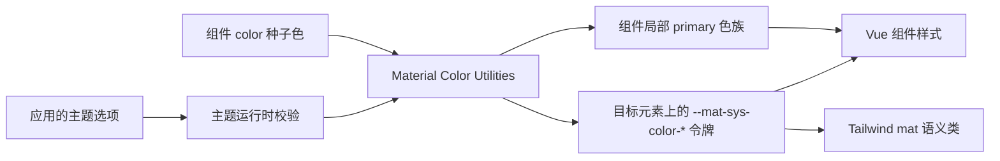
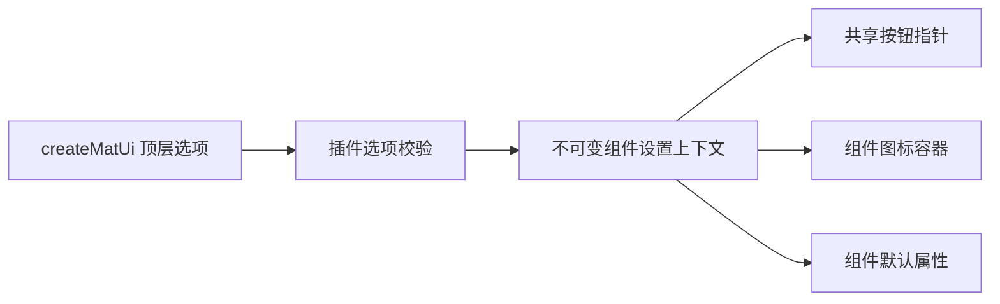
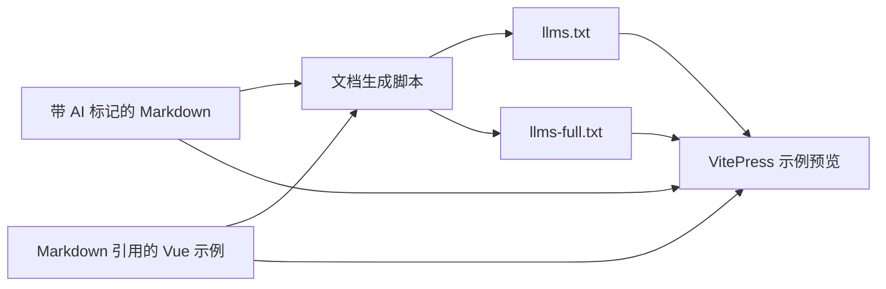

# 架构说明

## 当前状态

`mde-vue` 是一个私有的 Vue 3 单包组件库。源码经 Vite 编译为仓库内提交的单一核心 ESM，包 `exports` 只向使用方暴露 `dist/`；仓库同时包含带实时预览的 VitePress 中文使用文档、项目维护文档、测试和由 Markdown 生成的 AI 文档。

长期技术选择及原因记录在 [ADR 索引](adr/README.md)；公共概念和不变量见 [核心抽象](ABSTRACTIONS.md)。

## 架构原则

- 运行时只面向 Vue 3 客户端应用和最新浏览器。
- 组件渲染、主题计算、CSS 令牌和文档生成保持边界清晰。
- 组件默认读取语义令牌；显式十六进制 `color` 通过共享配色模块生成局部 Material 配色，不在组件内重复计算规则。
- 原生 CSS 令牌是运行时权威值；Tailwind 适配层只提供静态名称映射。
- Markdown、其直接引用的 Vue 示例文件与 `src/` 公共入口是使用文档和实时预览的权威来源；AI 文本是生成产物，`dist/` 另由分发检查验证。
- `src/` 是维护权威，`dist/` 是由构建生成并随同源码提交的分发边界，不接受手工修改。

## 共享组件基础层

`MatSurfaceBase` 负责表面组件的动态原生根元素和属性透传；`MatActionBase` 统一处理 button/link 及内部可聚焦宿主的禁用、状态层和键盘指针交互；`MatButtonBase` 在此基础上统一按钮根节点、原生属性、48px 交互目标、焦点和按下状态，供 `MatBtn` 与 `MatFab` 复用；`MatSelectionControlBase` 统一处理选择控件的原生 input、标签、48px 目标区、40px 状态层、属性路由和插件指针设置；`MatTextInputBase` 在此基础上提供浮动标签和辅助信息。`MatItemContentBase` 统一 List 与 MenuItem 的无语义内容排列，`useRovingFocus` 只管理 DOM 顺序和 tabindex，不定义组件键盘含义。这些基础层均为内部实现，不作为公共入口导出。`MatInputBase` 是例外：它作为公共的无边框原生 input/textarea 基础组件，供使用方自定义外层 UI。组件共享的数值工具模块统一处理 CSS 长度、边缘像素值和毫秒延迟的校验、转换与回退（数字与纯数字字符串按数字处理，字符串按 CSS 属性校验），只服务内部组件，不加入公共入口。

内部帧调度器将连续指针输入合并到下一次绘制，并支持交互结束前同步刷新最新输入；Slider、RangeSlider、Panes 与 Sheet 复用该调度器。内部动效控制器优先等待根元素及后代的实际 Web Animations 完成，取消或反向切换时使旧等待失效；只有测试或缺少该 API 的环境使用后备时长。

## 技术栈

| 技术 | 职责 |
| --- | --- |
| Vue 3 | 组件、插件和组合式主题 API |
| JavaScript 与 JSDoc | 运行时实现和公共接口说明 |
| 原生 CSS | 设计令牌、组件样式和状态层 |
| Material Color Utilities | 从种子色生成 Material 3 动态配色 |
| Tailwind CSS v4 | 可选的语义工具类适配 |
| Vite | 生成保留模块边界的 ESM 分发产物与提供 VitePress 开发服务 |
| VitePress | 中文文档和交互示例 |
| Vitest 与 Vue Test Utils | 组件和主题行为测试 |

## 模块边界

### 公共入口

`src/index.js` 是唯一 JavaScript 公共入口，导出全部组件、`Intersection` 指令、命令式 Dialog 与 Snackbar 函数，以及 `createMatUi()`、`useMatTheme()` 和 `useMatApp()`。构建将该入口编译为唯一运行时文件 `dist/mde-vue.js`，因此所有组件、Vue 上下文键、队列和协调器只存在一个模块实例。`dist/index.d.ts` 是完整根入口类型声明。包不提供组件、指令或函数子入口；`mde-vue/styles.css` 暴露基础令牌与全部组件样式，`mde-vue/tailwind.css` 暴露 Tailwind v4 映射。

公共入口不得依赖文档预览、VitePress 或测试代码，也不得要求安装 IDE 专用工具。

### 主题运行时

主题模块负责校验主题选项、按 Material 2025 phone 规格调用 Material Color Utilities、将 53 个颜色角色写入目标元素的 `--mat-sys-color-*` CSS 自定义属性，并在 `system` 模式下监听系统亮暗偏好。它向 Vue 应用提供可响应的当前配置、解析后的实际模式、运行时修改方法和清理方法。

共享配色模块同时服务全局主题与组件级十六进制种子色。组件局部配色只读取当前方案和对比度，生成亮暗 primary 色族并通过有界缓存复用结果；它不会写入主题目标。`MatFab` 只接受官方系统颜色角色，不调用组件级种子色配色路径。

主题模块不读取或写入 `localStorage`，也不决定应用应何时保存用户选择。

### 插件配置

`createMatUi()` 校验顶层插件选项，创建主题控制器，并通过独立的 Vue provide 上下文向组件提供不可变设置。当前组件设置包括是否为可用交互组件显示手指指针、组件图标容器使用的全局 `iconClass`，以及按组件键配置的默认属性（defaults）。defaults 的键是 `mat-*` 标签去掉前缀后的 camelCase，值为该组件可配置的 prop 默认值；显式传入的 prop 优先，`v-model` 相关属性不接受配置，Tooltip 的打开延迟与同组快速切换时长通过 `defaults.tooltip` 提供。插件以 `mat-*` 和对应 `Mat*` 名称全局注册组件，并以 `intersection` 名称注册 `v-intersection` 指令。顶层选项不会写入主题控制器；未安装插件的按需组件和指令使用组件定义默认值。

### 组件

`MatAppRoot` 建立应用级布局坐标系与隔离覆盖层。默认正文随 document/body 增长和滚动，`scrollable` 切换为确定高度内的正文滚动；组件不修改页面根滚动样式。布局上下文使用 `ResizeObserver`、视口事件和显式 `update()` 测量根与登记元素，汇总安全区、四向 padding、内容尺寸、容器断点和边缘信息。边缘按登记顺序产生正交 inset，同侧外延取最大值。内部覆盖层按层级依次承载固定边缘、自由定位、Snackbar 与普通浮动组件、模态层，不公开 Slot；`useMatApp()` 只暴露深只读响应式 layout 与 `registerEdge()`。

每个组件拥有自己的 Vue SFC、公开入口、样式与测试。`MatBadge` 默认以相对定位的 `inline-flex` 包装目标并绝对定位指示器，Inline 模式则只渲染参与自然布局的指示器；两种模式都不建立交互语义。`MatSpacer` 是不进入无障碍树的空 flex 子元素，只通过增长分配父容器主轴剩余空间。`MatBtn` 以同一个原生 `<button>` 组件提供普通按钮和图标模式：`icon=true` 解析默认 Slot 的 Material Symbols 文本，字符串 `icon` 使用 prop 文本，未设置 `icon` 时仍按普通按钮渲染并允许默认 Slot 直接放置 `MatIcon`；普通模式也可使用 `prefix`、`suffix` 或同名 Slots。`MatFab` 以同一个原生 `<button>` 组件提供纯图标 FAB 和 Extended FAB：默认 Slot 有非空内容时显示 Extended 标签，否则要求 `icon` 与 `label` 并显示 Tooltip；`app` 模式自动进入最近 AppRoot 的普通浮动组。两者共享 `MatButtonBase` 的原生交互和状态逻辑。按钮组与 split button 使用 Vue provide/inject 协调 `MatBtn` 子按钮，不复制交互协议；standard 选中态沿用普通按钮的 round/square 反转，connected 选中态使用覆盖四角的全圆 checked shape。split button 只负责两侧按钮、展开状态和 ARIA，不渲染菜单。
每个组件拥有自己的 Vue SFC、公开入口、样式与测试。`MatHover` 是无渲染交互组件，通过作用域 Slot 向使用方提供 hover 状态和目标事件 props，不引入包装元素；它只处理鼠标进入、离开及可取消的开放/关闭延迟。`v-intersection` 是独立的原生观察指令，绑定值直接映射 `IntersectionObserver` 回调和初始化选项，使用元素级 WeakMap 管理生命周期，不向 DOM 写入私有字段。`MatSpacer` 是不进入无障碍树的空 flex 子元素，只通过增长分配父容器主轴剩余空间。`MatBtn` 以同一个原生 `<button>` 组件提供普通按钮和图标模式：`icon=true` 解析默认 Slot 的 Material Symbols 文本，字符串 `icon` 使用 prop 文本，未设置 `icon` 时仍按普通按钮渲染并允许默认 Slot 直接放置 `MatIcon`；普通模式也可使用 `prefix`、`suffix` 或同名 Slots。`MatFab` 以同一个原生 `<button>` 组件提供纯图标 FAB 和 Extended FAB：默认 Slot 有非空内容时显示 Extended 标签，否则要求 `icon` 与 `label` 并显示 Tooltip。两者共享 `MatButtonBase` 的原生交互和状态逻辑。按钮组与 split button 使用 Vue provide/inject 协调 `MatBtn` 子按钮，不复制交互协议；standard 选中态沿用普通按钮的 round/square 反转，connected 选中态使用覆盖四角的全圆 checked shape。split button 只负责两侧按钮、展开状态和 ARIA，不渲染菜单。

Tooltip 的模块级协调器继续保证同一时间只有一个活动实例，并使用以分组容器为键的 WeakMap 保存最近实际显示的实例标识和快速切换有效期。分组由展示元素最近的 `data-mat-tooltip-group` 祖先明确声明，不根据标签名或组件层级推断；未分组或未配置跳过时长时不共享打开状态。省略显式 attach 时，已打开的 top-layer 祖先优先，其次使用目标所属 AppRoot 并读取布局 padding 生成避让矩形，目标不属于当前 AppRoot 时回退 body 与 Toolbar 几何注册表。Plain 与 Rich tooltip 复用同一触发、定位、延迟和堆叠协议；Rich 由显式 rich 或 subhead/action 内容启用，subhead 与 supporting content 同时支持 prop 和 Slot，action 只使用 Slot，指针或焦点进入 Rich 表面时继续维持自动展示。

`MatContainer` 以始终铺满父容器的外层统一视口断点水平内边距，并在内部正文层以 1040px 最大宽度和自动外边距控制可读宽度；正文层在外层具有确定块轴尺寸时同步铺满高度，外层尺寸未确定时仍由内容自然撑开。`fluid` 只取消正文层的最大宽度，不影响外层边距或尺寸。

Icon 统一字体字形、SVG 资源和默认 Slot 中的 SVG 元素，负责 Material Symbols 经典四轴、尺寸、内容颜色和动态根标签。内容来源优先级固定为 `src`、`icon`、默认 Slot；组件级 `iconClass` 可覆盖或关闭插件全局值。按钮、List、Menu 和文本输入复用同一公共 Icon 实现，但各自负责上下文尺寸、颜色和无障碍语义。

Shape 把 35 个归一化 Material 3 Expressive 轮廓固化为 CSS `clip-path: shape()` 百分比曲线，按名称查表渲染，不在运行时执行几何转换。组件以等宽高容器承载居中的默认 Slot，统一复用 CSS 长度处理、局部 Material 配色和动态 HTML 根标签；默认是 48px primary circle 的 `div`。

`MatImage` 以根容器包裹内部原生 ``，提供可配置圆角（默认引用 extra-large 形状令牌）、`cover`/`contain` 填充、宽高比和默认开启的 outline 描边。组件上的 class 与 style 属于根容器，其余原生属性与监听器以及 `img-class`、`img-style` 定向到 `img`；根元素对 `aspect-ratio`、`inline-size`、`block-size` 和 `border-radius` 使用系统动效令牌表达尺寸变化。

Card 组合 `MatSurfaceBase` 与可选 `MatCardActionArea`，提供 filled、elevated、outlined 三种中性表面和局部种子配色。Headline、Subhead 与 Media 既可以由 Card 的同名具名 Slot 自动创建，也可以作为 `MatCardHeadline`、`MatCardSubhead`、`MatCardMedia` 子组件直接组合；Content 与 Actions 继续负责 16px 内容内边距和末端对齐的操作布局。Divider 作为 Card 直接子项时以明确横向尺寸完整分隔区域，布尔 inset 模式在两侧保留系统缩进。

List 通过内部 provide/inject 上下文统一交互模式、受控选择、折叠值和焦点刷新。普通与操作模式保留 `ul/li`；MatListGroup 作为根列表的 `li`，在其中组合 Activator 按钮、可惰化的内容容器和嵌套 `ul`。有值分组由根 List 的 `expanded` 数组控制，无值分组保存内部状态。选择模式使用 `listbox/option`，折叠分组在该模式下降级为始终展开的静态 `group`，避免把 disclosure 按钮放入 listbox。roving tabindex 注册表按 DOM 顺序协调直属项目、分组 Activator、展开项目和 multi-action trailing 控件，并在模式切换或卸载时恢复使用方原有的 tabindex。Divider 根据 List 上下文切换合法的根语义，不参与选择与焦点顺序。

Panes 通过内部 provide/inject 注册直接的 `MatPane` 子项，按受控权重使用横向 flex 布局，并由每个相邻 Pane 的子级渲染垂直 separator 调整控件。父组件只在指针释放或键盘调整后发出下一组权重；ResizeObserver 的宽度通知使用尾端防抖，浏览器断点只报告视口等级变化。Pane 默认填满父级块轴高度并在自身内容溢出时滚动，显隐由使用方通过 `v-if` 管理。

Text field 与 Textarea 共享 `MatInputBase` 的无边框原生控件基础层，但分别保留 input 和 textarea 原生语义；`MatTextInputBase` 负责它们的 outlined/filled 外观、标签、前后缀、辅助信息和字符计数，并允许 Select 以内部 custom 控件复用相同字段外观。自动增高以 rows 为下限，可以由 maxRows 封顶；手动调整能力由独立的 noResize 控制。Select 使用可见 combobox 与 Menu 管理单选、多选和 Chips 展示，同时以移出焦点及无障碍树的原生 select 同步 options、required 和字符串化表单值。其他输入类型可以直接组合 `MatInputBase`，自行提供容器和交互语义。Menu 组合 `MatSurfaceBase` 与 Popover，通过受控 `modelValue` 管理显示，支持 `activator` Slot 或元素 id 的 CSS anchor 定位和 `[clientX, clientY]` 视口坐标定位，并负责 offset、视口夹紧、多级开关和 menu/menuitem 键盘语义；MenuItem 组合 `MatActionBase`。位于 `MatAppRoot` 内时，视口夹紧与透明 scrim 以该 AppRoot 的应用矩形为边界，点击应用外只关闭菜单且不拦截事件。MatMenuGroup 提供带可选标签的 `role="group"`、独立 level 2 表面和 expressive 间隙分组。Menu 与 List 只共享无语义内容排列和 roving focus 工具，不共享选择模型或根语义。Divider 在 Menu 中切换为 separator。

Dialog 组合 `MatSurfaceBase` 与原生 `<dialog>` 元素（非模态 `show()`），通过 Teleport 挂载到 body、指定元素或 AppRoot 模态层；模板实例可通过 `activator` Slot 渲染唯一触发元素并在关闭后恢复焦点。组件自管焦点陷阱、背景拦截与滚动锁，不依赖浏览器 top layer；位于 `MatAppRoot` 内且省略 `attach`（或 `attach` 指向 AppRoot 根元素）时，渲染进该 AppRoot 的模态层并把表面与帷幕限制在应用矩形内，仅正文层 `inert`，AppRoot 外内容保持可交互。组件在退出动画期间保留打开状态和 DOM；共享堆叠管理器只显示顶层帷幕。`dialog()`、`alert()`、`confirm()` 与 `prompt()` 使用一次性 Vue 宿主复用同一组件，关闭动画完成并清理宿主后再结算 Promise。命令式宿主读取最后安装的插件组件设置与主题控制器；未安装插件时使用默认设置。

Bottom sheet 与 Side sheet 通过内部 `MatSheetBase` 复用受控开关、standard/modal/auto 变体、进入退出阶段、原生 `<dialog>` 元素（非模态 `show()`）、Teleport、焦点陷阱、帷幕、Escape、滚动锁、堆叠和触摸拖动关闭。Standard 根使用原生 `aside` 并在声明位置参与父级 flex 布局，不锁滚动或移动焦点；modal 根作为铺满坐标空间的帷幕容器，内部面板贴边，不进入浏览器 top layer。Auto 默认在 840px 以下使用 modal、在更宽视口使用 standard，并在窗口尺寸跨越断点时切换根语义。Bottom sheet 固定在块轴末端、最大宽度 640px，通过受控 `expanded` 状态、可操作把手和拖动表达预览与展开高度；Side sheet 使用 start/end 逻辑边缘、400px 最大宽度和默认关闭入口。两个公共组件不互相替换。

Snackbar 使用 `modelValue` 请求展示而不移动焦点。AppRoot 内的模板实例 Teleport 到应用 Snackbar 组并排列在普通浮动组上方；其他模板实例和命令式宿主固定在 body 视口底部。它提供一个可选的文字 action 与可选关闭入口；`actionText` 与 `action` Slot、`closable` 与 `close` Slot 分别遵守 Slot 优先规则，action 触发后关闭当前通知。模块级 FIFO 调度器同时协调所有模板实例和 `snackbar()` / `toast()` 命令式请求；活动项只在退出动画完成后释放下一项，排队模板项可由 `modelValue=false` 或卸载取消。命令式 Snackbar 使用单个可复用 Vue 宿主并注入最后安装插件的组件设置与主题控制器；`onAction` 回调在 action 触发时调用，宿主没有待显示内容时移除，Promise 在退出与清理完成后结算。

Navigation 以 `MatNavigationRail` 与 `MatNavigationRailItem` 组合纵向 Expressive navigation rail 和横向 Flexible navigation bar。两种模式默认在声明位置参与父容器布局；设置 `app` 后才通过 Teleport 建立应用导航。省略显式 attach 且位于 AppRoot 时，纵向登记 start/end、横向登记 bottom，modal 展开只保留 collapsed host 占位；其他场景固定到显式 attach。`placeholder` 与 `bottomPlaceholder` 只在应用模式下生效。纵向模式提供 collapsed/expanded、可配置展开宽度、起始/末尾侧 Item 对齐、standard/modal、可隐藏 expanded 容器、顶部或居中的目的地组与底部内容 Slot；横向模式由同一个 `expanded` 状态切换纵向或横向 Item。父组件通过 provide/inject 统一受控单选、展开状态、导航方向与 Item 对齐，Item 保留原生按钮或链接语义；窗口断点切换由使用方负责。

Toolbar 以容器内绝对定位表达底部 docked，以及顶部、底部和左右 floating 布局，并由 `position` 在对应轴上对齐。`app` 开启且省略显式 attach 时自动进入最近 AppRoot：docked 登记 bottom，floating 不进入布局但读取四向 padding 避让；其他应用模式仍固定到显式 attach 并使用 Toolbar 几何注册表。`placeholder` 在声明位置提供可选占位，floating 在 AppRoot 内仍可用它保护滚动末端；`bottomPlaceholder` 只扩展 docked 和底部 floating 的安全区。

App bar 以 `MatAppBar` 根组件组织 leading、唯一主内容区、subtitle 与 trailing，默认 Slot 通过显式 `content` 区分 headline、image 和 search；独立的 `MatSearch` 复用公共 `MatInputBase` 提供直接输入，不依赖 App bar。默认实例在声明位置使用 64px sticky 布局壳，flexible 展开背景和内容位于不改变布局高度的视觉层，展开差值由紧随其后的起始占位承担；`app` 自动接入 AppRoot 时同样只登记固定 64px top edge。具名 CSS scroll timeline 由实例级名称和共享引用计数登记到显式滚动源、AppRoot 正文、最近滚动祖先或 document，`timeline-scope` 使 Teleport 后的 App bar 仍能读取同一进度；运行时不逐帧写入动画样式，也不让动画中的几何变化反向改变时间线滚动范围。

Loader 以单个组件的 `linear` 与 `circular` variant 表达两种 Progress indicator 形态。确定状态在根元素上提供 progressbar ARIA 值，不确定状态仅保留进度语义和动画；波浪形活动指示器由内联 SVG 绘制，轨道保持平直。环形宽高由支持数字与纯数字字符串并限制在 24 至 240 的 `size` 控制，路径半径为 heavy 波浪形预留稳定边界；线条形忽略 `size`。两种形态通过 `default` 与 `heavy` 粗细档位保持一致的公共接口。组件只读取系统 primary 与 secondary container 颜色角色，显式 `color` 通过共享局部配色模块替换活动与停止指示器色。

Checkbox 以布尔值或基础值数组表达受控选择，数组更新始终返回新数组。Radio 可以独立受控；进入 Radio group 后由 provide/inject 上下文统一选中值、禁用、配色和按 DOM 顺序维护的 roving tabindex。Switch 只表达立即生效的布尔状态。三类控件保留原生 input 语义，但不承诺表单提交、原生校验、重置或表单代理方法。Chip 复用 MatActionBase 的单一原生按钮和状态层，以 variant 区分辅助、筛选、输入与建议外观；独立 filter/input 使用受控 selected，input 默认关闭图标区域发出 remove 请求。ChipSet 通过 provide/inject 让带 value 的 filter/input 绑定受控 single/multiple 模型，scroll 布局组合横向 MatScrollArea 并选择性启用其拖拽滚动；拖拽阈值、pointer capture、滚动位置、取消清理和 click 抑制均由 ScrollArea 管理。ChipSet 不删除数据，也不建立焦点、编辑或拖拽重排模型。

### 样式层

基础样式公开两层令牌：`--mat-ref-*` 保存文字与图标字体等参考值，`--mat-sys-*` 保存颜色、排版、形状、海拔、动效、状态和交互值。动效同时保留旧 duration/easing 令牌，并提供 Material 3 Expressive 的 fast/default/slow spatial 与 effects 复合令牌；空间变化使用 spatial，颜色和透明度使用无回弹 effects。组件可以使用 `--mat-<component>-*`、`--mat-button-*` 等 CSS 自定义属性组织尺寸、变体和状态样式，但这些变量属于内部实现，不提供公共定制或兼容承诺。Icon 的字体由 `iconClass` 对应样式决定，字体与 SVG 资源仍由使用方加载。

排版系统在各轴令牌之上提供 30 个 `.mat-sys-typescale-*` 公共 class；`MatText` 根据 `type`、`size` 与 `emphasized` 选择同一套 class，并通过 `as` 提供动态 HTML 根元素。工具 class 不设置字体族，继续继承应用字体。Tailwind 适配文件通过 `@theme inline` 将公开的 reference 和 system 值映射到带 `mat` 前缀的 Tailwind 主题变量，不重新定义主题来源。

### 文档实时预览与 AI 文档

`docs/site/` 是 VitePress 的唯一源目录，包含中文使用文档、AI 使用指南和组件实时预览。预览保持 `mde-vue` 根入口写法，但由 Vite alias 直接解析到 `src/index.js` 与源码样式，使示例和热更新始终验证维护权威；不另建独立 demo 页面。`docs/project/` 保存产品愿景、架构、公共抽象、开发入门和 ADR，不进入 VitePress 构建。

`docs/site/` 中带 frontmatter 标记的 Markdown 页面按顺序生成根目录 `llms.txt` 和 `llms-full.txt`。组件示例保存在 `docs/site/examples/`，同一 Vue 文件既由 VitePress 作为代码片段展示，也作为页面中的真实组件渲染；AI 文档生成器会把代码片段包含指令展开为完整代码块。项目维护文档和纯交互页面不进入 AI 使用文档。

## 关键数据流

## 外部依赖与运行边界

- Vue 是 peer dependency，由使用方应用提供。
- Material Color Utilities 是主题运行时依赖。
- Tailwind CSS v4 是可选 peer dependency；不使用 Tailwind 的项目只导入基础样式。
- Material Symbols 或其他图标字体是可选的应用资源；Icon 也不下载外部 SVG，插件不会发起网络请求。
- 项目无服务端、数据库、缓存、遥测或远程运行时服务。
- 私有 GitHub 仓库是源码分发边界，使用方应锁定具体提交。

## 构建与验证

`pnpm build` 先生成完整根入口类型声明，再以 Vue 和 Material Color Utilities 为外部依赖编译单一 `dist/mde-vue.js`，将基础令牌与组件样式合并为 `dist/styles.css`，复制 `src/styles/tailwind.css` 至 `dist/tailwind.css` 并复制 `dist/index.d.ts`。构建后 `dist/` 必须恰好包含这四个文件。`dist/` 随源码提交，公开入口测试从包自身 `exports` 加载产物并检查文件集合。VitePress 只构建 `docs/site/`，并在其 Vite 配置中把公共导入别名解析到 `src/`；文档、测试和静态检查在 Node.js 24 环境中运行。

## 安全与可靠性边界

- 主题输入在写入 CSS 属性前校验，非法种子色、模式、变体和对比度必须明确失败或按公共 API 约定处理。
- `system` 模式创建的媒体查询监听必须可清理，避免应用卸载后继续更新状态。
- 组件不执行网络请求，不持有业务数据，也不承担表单校验或权限控制。
- 选择控件只管理 Vue 受控状态；透传的原生 input 属性不构成完整表单生命周期保证。

## 相关决策

- [0001 — 通过私有 Git 直接分发源码](adr/0001-distribute-source-from-private-git.md)
- [0002 — 采用运行时令牌与 Tailwind 适配双层主题（已由 0006 替代）](adr/0002-runtime-and-tailwind-theme-layers.md)
- [0003 — 从 Markdown 生成 AI 使用文档](adr/0003-generate-ai-docs-from-markdown.md)
- [0004 — 采用 Material 2025 动态配色规格](adr/0004-material-2025-dynamic-color.md)
- [0005 — 采用组件级种子配色与父子继承](adr/0005-component-seed-color-inheritance.md)
- [0006 — 采用 Material 3 分层令牌与完整组件属性名（已由 0007 替代）](adr/0006-material-3-layered-tokens-and-full-property-names.md)
- [0007 — 保留内部组件令牌但不提供公共定制入口](adr/0007-internal-component-tokens-without-public-customization.md)
- [0009 — 采用公共 Icon 与可配置图标类](adr/0009-public-icon-and-configurable-icon-class.md)
- [0010 — 合并 Button 与 Icon button](adr/0010-merge-button-and-icon-button.md)
- [0011 — 采用共享 Dialog 宿主与关闭后 Promise 结算](adr/0011-dialog-imperative-host-and-promise-settlement.md)
- [0012 — 使用内部 Toolbar 几何注册协调覆盖层](adr/0012-toolbar-overlay-geometry-registry.md)
- [0013 — 重构按钮组与图标按钮语义（已由 0014 替代）](adr/0013-button-icon-group-semantics.md)
- [0014 — 连接按钮组选中态使用全圆形状（已由 0015 替代）](adr/0014-connected-button-group-checked-shape.md)
- [0015 — 连接按钮组选中态完整覆盖组外轮廓](adr/0015-connected-button-group-checked-shape-overrides-outer-shape.md)
- [0016 — 公开 MatInputBase 作为可组合文本输入基础组件](adr/0016-public-input-base.md)
- [0021 — 采用 AppRoot 应用布局上下文](adr/0021-app-root-layout-context.md)
- [0022 — 项目更名为 mde-vue](adr/0022-rename-project-to-mde-vue.md)
- [0023 — createMatUi 组件默认属性 defaults 配置](adr/0023-mat-ui-component-defaults.md)
- [0026 — 采用 Material 3 Expressive Web 动效令牌](adr/0026-material-3-expressive-motion-tokens.md)
- [0027 — AppRoot 内模态与浮层按应用范围展示](adr/0027-approot.md)
