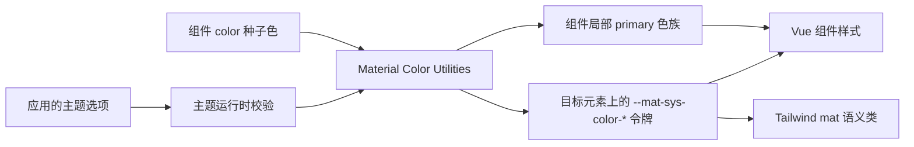
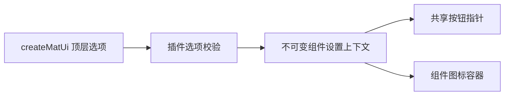
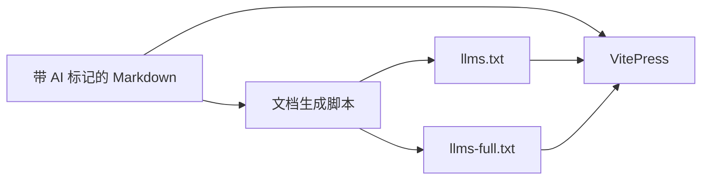

# 架构说明

## 当前状态

`mdu-ui` 是一个私有的 Vue 3 单包组件库。源码由包 `exports` 直接暴露给使用方的 Vue/Vite 构建过程；仓库同时包含本地 demo、VitePress 中文使用文档、项目维护文档、测试和由 Markdown 生成的 AI 文档。

长期技术选择及原因记录在 [ADR 索引](adr/README.md)；公共概念和不变量见 [核心抽象](ABSTRACTIONS.md)。

## 架构原则

- 运行时只面向 Vue 3 客户端应用和最新浏览器。
- 组件渲染、主题计算、CSS 令牌和文档生成保持边界清晰。
- 组件默认读取语义令牌；显式十六进制 `color` 通过共享配色模块生成局部 Material 配色，不在组件内重复计算规则。
- 原生 CSS 令牌是运行时权威值；Tailwind 适配层只提供静态名称映射。
- Markdown 是人工维护的使用文档权威来源，AI 文本是生成产物。
- 包不生成或提交用于分发的 `dist/`。

## 共享组件基础层

`MatSurfaceBase` 负责表面组件的动态原生根元素和属性透传；`MatActionBase` 在其上统一处理 button/link 的语义、禁用、状态层和键盘指针交互。两者均为内部实现，Card 及后续 Dialog、List 等组件可以复用，不作为公共入口导出。

## 技术栈

| 技术 | 职责 |
| --- | --- |
| Vue 3 | 组件、插件和组合式主题 API |
| JavaScript 与 JSDoc | 运行时实现和公共接口说明 |
| 原生 CSS | 设计令牌、组件样式和状态层 |
| Material Color Utilities | 从种子色生成 Material 3 动态配色 |
| Tailwind CSS v4 | 可选的语义工具类适配 |
| Vite | demo 与公开入口构建检查 |
| VitePress | 中文文档和交互示例 |
| Vitest 与 Vue Test Utils | 组件和主题行为测试 |

## 模块边界

### 公共入口

`src/index.js` 是完整包入口，导出 `MatBtn`、`MatIconBtn`、`MatBtnGroup`、`MatSplitBtn`、`createMatUi()` 和 `useMatTheme()`。四个组件分别提供 `mdu-ui/components/<组件目录>` 单组件入口。`mdu-ui/styles.css` 和 `mdu-ui/tailwind.css` 分别暴露基础令牌与可选 Tailwind 映射。

公共入口不得依赖 demo、VitePress 或测试代码，也不得要求安装 IDE 专用工具。

### 主题运行时

主题模块负责校验主题选项、按 Material 2025 phone 规格调用 Material Color Utilities、将 53 个颜色角色写入目标元素的 `--mat-sys-color-*` CSS 自定义属性，并在 `system` 模式下监听系统亮暗偏好。它向 Vue 应用提供可响应的当前配置、解析后的实际模式、运行时修改方法和清理方法。

共享配色模块同时服务全局主题与组件级十六进制种子色。组件局部配色只读取当前方案和对比度，生成亮暗 primary 色族并通过有界缓存复用结果；它不会写入主题目标。

主题模块不读取或写入 `localStorage`，也不决定应用应何时保存用户选择。

### 插件配置

`createMatUi()` 校验顶层插件选项，创建主题控制器，并通过独立的 Vue provide 上下文向组件提供不可变设置。当前组件设置包括是否为可用交互组件显示手指指针，以及是否让组件图标容器使用 Material Symbols。顶层布尔选项不会写入 DOM 或主题控制器，也不改变按需导入组件在未安装插件时的默认行为。

### 组件

每个组件拥有自己的 Vue SFC、公开入口、样式与测试。按钮和图标按钮共享原生 `<button>` 基础结构、状态层、插件设置和上下文合并逻辑；按钮组与 split button 使用 Vue provide/inject 协调子按钮，不复制交互协议。split button 只负责两侧按钮、展开状态和 ARIA，不渲染菜单。

### 样式层

基础样式公开两层令牌：`--mat-ref-*` 保存文字与图标字体等参考值，`--mat-sys-*` 保存颜色、排版、形状、海拔、动效、状态和交互值。组件可以使用 `--mat-<component>-*`、`--mat-button-*` 等 CSS 自定义属性组织尺寸、变体和状态样式，但这些变量属于内部实现，不提供公共定制或兼容承诺。Material Symbols 选项只应用字体族与连字规则，字体资源仍由使用方加载。

Tailwind 适配文件通过 `@theme inline` 将公开的 reference 和 system 值映射到带 `mat` 前缀的 Tailwind 主题变量，不重新定义主题来源。

### demo、文档与 AI 文档

demo 从包的公开出口加载组件和样式，用于人工查看主题与组件状态。`docs/site/` 是 VitePress 的唯一源目录，包含中文使用文档、AI 使用指南和交互示例。`docs/project/` 保存产品愿景、架构、公共抽象、开发入门和 ADR，不进入 VitePress 构建。

`docs/site/` 中带 frontmatter 标记的 Markdown 页面按顺序生成根目录 `llms.txt` 和 `llms-full.txt`；项目维护文档和纯交互页面不进入 AI 使用文档。

## 关键数据流

## 外部依赖与运行边界

- Vue 是 peer dependency，由使用方应用提供。
- Material Color Utilities 是主题运行时依赖。
- Tailwind CSS v4 是可选 peer dependency；不使用 Tailwind 的项目只导入基础样式。
- Material Symbols 字体是可选的应用资源；插件不会下载字体或发起网络请求。
- 项目无服务端、数据库、缓存、遥测或远程运行时服务。
- 私有 GitHub 仓库是源码分发边界，使用方应锁定具体提交。

## 构建与验证

Vite 构建检查从公开 `exports` 导入 `.vue` 和 CSS，验证普通 Vue/Vite 使用方能直接编译源码。VitePress 只构建 `docs/site/`；文档、测试和静态检查在 Node.js 24 环境中运行，构建产物仅用于验证并保持忽略。

## 安全与可靠性边界

- 主题输入在写入 CSS 属性前校验，非法种子色、模式、变体和对比度必须明确失败或按公共 API 约定处理。
- `system` 模式创建的媒体查询监听必须可清理，避免应用卸载后继续更新状态。
- 组件不执行网络请求，不持有业务数据，也不承担表单校验或权限控制。

## 相关决策

- [0001 — 通过私有 Git 直接分发源码](adr/0001-distribute-source-from-private-git.md)
- [0002 — 采用运行时令牌与 Tailwind 适配双层主题（已由 0006 替代）](adr/0002-runtime-and-tailwind-theme-layers.md)
- [0003 — 从 Markdown 生成 AI 使用文档](adr/0003-generate-ai-docs-from-markdown.md)
- [0004 — 采用 Material 2025 动态配色规格](adr/0004-material-2025-dynamic-color.md)
- [0005 — 采用组件级种子配色与父子继承](adr/0005-component-seed-color-inheritance.md)
- [0006 — 采用 Material 3 分层令牌与完整组件属性名（已由 0007 替代）](adr/0006-material-3-layered-tokens-and-full-property-names.md)
- [0007 — 保留内部组件令牌但不提供公共定制入口](adr/0007-internal-component-tokens-without-public-customization.md)
